[English](./README.md) | [Español](./README.es.md) | [Português](./README.pt.md)

# Puente

Plataforma de remesas P2P para América Latina construida sobre blockchain Celo.

## Descripción General

Puente es una aplicación de remesas no custodial diseñada para reducir la fricción en pagos transfronterizos para usuarios en economías de alta inflación. La plataforma aprovecha la blockchain L2 de Celo y la stablecoin cUSD para proporcionar transferencias internacionales rápidas y de bajo costo con una interfaz mobile-first.

La aplicación aborda una necesidad financiera crítica en América Latina, donde los servicios tradicionales de remesas cobran un promedio del 15% en comisiones y tardan días en liquidar. Al usar tecnología blockchain y stablecoins, Puente reduce los costos de transacción a menos de $0.01 y liquida transferencias en menos de 5 segundos.

Construida como una aplicación web progresiva (PWA) optimizada para integración con MiniPay, la plataforma prioriza la accesibilidad para usuarios en redes de bajo ancho de banda mientras mantiene una interfaz profesional e intuitiva.

## Arquitectura

```mermaid
graph TD
    A[Frontend Next.js 14] --> B[Capa de Auth Privy]
    B --> C[Wallet Embebida]

    A --> D[Backend Supabase]
    D --> E[Base de Datos PostgreSQL]
    D --> F[Edge Functions]

    C --> G[Red Celo L2]
    G --> H[Stablecoin cUSD]
    G --> I[Smart Contracts]

    A --> J[SocialConnect/ODIS]
    J --> K[Mapeo Teléfono-a-Dirección]

    I --> L[Contrato de Remesas]
    I --> M[Contrato de Escrow]

    style G fill:#FCFF52,stroke:#000,color:#000
    style H fill:#FCFF52,stroke:#000,color:#000
    style A fill:#000,stroke:#fff,color:#fff
    style D fill:#3ECF8E
```



## Características

### Integración Blockchain

- **Liquidación Celo L2**: Finalidad rápida (<5s)
- **Stablecoin cUSD**: Protección contra volatilidad de moneda local
- **Smart Contracts**: Contratos verificados en Celo Sepolia para enrutamiento seguro de fondos
- **Abstracción de Gas**: Comisiones de transacción bajo $0.01

### Identidad y Descubrimiento

- **SocialConnect**: Mapeo teléfono-a-dirección vía ODIS (Servicio de Identidad Descentralizada Oblivious)
- **Descubrimiento Social**: Envía fondos usando números de teléfono en lugar de direcciones de wallet
- **Preservación de Privacidad**: Búsqueda de identidad descentralizada sin exponer datos de usuario

### Experiencia de Usuario

- **Glassmorphism UI**: Interfaz translúcida moderna con profundidad y jerarquía
- **Tematización Dinámica**: Soporte de modo claro/oscuro (temas Solaris/Obsidian)
- **Controles de Privacidad**: Balances sensibles ofuscados por defecto hasta autenticación
- **Mobile-First**: PWA optimizada para MiniPay (Opera Mini) y redes de bajo ancho de banda
- **Feedback Háptico**: Micro-interacciones visuales para confirmación de acciones

### Seguridad

- **No Custodial**: Los usuarios mantienen control total de sus fondos
- **Autenticación Privy**: Wallets embebidas con soporte de passkey
- **Registro de Auditoría**: Historial de transacciones en tiempo real vía Supabase
- **Verificación de Smart Contracts**: Todos los contratos verificados en el explorador de bloques Celo

## Stack Tecnológico


**Frontend**:

- [Next.js 14](https://nextjs.org/) - Framework React con App Router
- [TypeScript](https://www.typescriptlang.org/) - Desarrollo type-safe
- [Tailwind CSS](https://tailwindcss.com/) - Estilos utility-first
- [Framer Motion](https://www.framer.com/motion/) - Animaciones aceleradas por hardware

**Blockchain**:

- [Celo](https://celo.org/) - Red blockchain L2 (testnet Sepolia)
- [cUSD](https://docs.celo.org/protocol/stability) - Stablecoin Celo Dollar
- [SocialConnect](https://docs.celo.org/protocol/identity) - Protocolo de identidad descentralizada
- [ODIS](https://docs.celo.org/protocol/identity/odis) - Servicio de identidad descentralizada oblivious

**Infraestructura**:

- [Privy](https://privy.io/) - Autenticación de wallet embebida
- [Supabase](https://supabase.com/) - Base de datos PostgreSQL y Edge Functions
- [Vercel](https://vercel.com/) - Despliegue en red edge

## Primeros Pasos

### Prerequisitos

- Node.js 18 o superior
- Gestor de paquetes pnpm
- Cuenta Privy (tier gratuito disponible)
- Cuenta Supabase (tier gratuito disponible)
- Wallet Celo con cUSD de testnet (para pruebas)

### Instalación

1. **Clonar el repositorio**:

```bash
git clone https://github.com/LuisSambrano/puente.git
cd puente
```

2. **Instalar dependencias**:

```bash
pnpm install
```

3. **Configurar variables de entorno**:

Crear un archivo `.env.local` en el directorio raíz:

```env
# Configuración Privy
NEXT_PUBLIC_PRIVY_APP_ID=tu_privy_app_id

# Configuración Supabase
NEXT_PUBLIC_SUPABASE_URL=tu_supabase_url
NEXT_PUBLIC_SUPABASE_ANON_KEY=tu_supabase_anon_key

# Red Celo
NEXT_PUBLIC_CELO_NETWORK=celo-sepolia
```

Consulta `.env.example` para una lista completa de variables requeridas.

4. **Ejecutar el servidor de desarrollo**:

```bash
pnpm dev
```

5. **Abrir la aplicación**:

Navega a [http://localhost:3000](http://localhost:3000) en tu navegador.

### Comandos de Desarrollo

```bash
pnpm dev                        # Iniciar servidor de desarrollo
pnpm build                      # Construir para producción
pnpm lint                       # Ejecutar verificaciones ESLint
pnpm type-check                 # Ejecutar verificación de tipos TypeScript
pnpm contracts:compile          # Compilar smart contracts
pnpm contracts:test             # Ejecutar tests de contratos
pnpm contracts:deploy           # Desplegar contratos a testnet
```

## Estructura del Proyecto

```
puente/
├── apps/
│   ├── web/                    # Aplicación frontend Next.js
│   │   ├── src/
│   │   │   ├── app/           # Páginas App Router
│   │   │   ├── components/    # Componentes React
│   │   │   ├── lib/           # Utilidades y configuraciones
│   │   │   └── types/         # Definiciones TypeScript
│   │   └── public/            # Assets estáticos
│   └── contracts/             # Desarrollo de smart contracts
│       ├── contracts/         # Contratos Solidity
│       ├── scripts/           # Scripts de despliegue
│       └── test/              # Tests de contratos
├── docs/                      # Documentación
├── brandkit/                  # Assets de marca
└── turbo.json                 # Configuración Turborepo
```

## Smart Contracts

La plataforma usa smart contracts verificados desplegados en Celo Sepolia testnet:

- **RemittanceContract**: Maneja transferencias peer-to-peer con funcionalidad de escrow
- **EscrowContract**: Gestiona mecanismos de bloqueo y liberación de fondos

Las direcciones de contratos y enlaces de verificación están disponibles en el directorio [docs/contracts](./docs/contracts).

## Contribuir

Las contribuciones son bienvenidas. Por favor sigue estas pautas:

1. Haz fork del repositorio
2. Crea una rama de feature: `git checkout -b feature/descripcion`
3. Realiza tus cambios con commits claros y atómicos
4. Ejecuta tests: `pnpm test`
5. Push a tu fork: `git push origin feature/descripcion`
6. Envía un pull request con una descripción detallada

### Convención de Commits

Este proyecto sigue [Conventional Commits](https://www.conventionalcommits.org/):

- `feat`: Nueva característica
- `fix`: Corrección de bug
- `refactor`: Refactorización de código
- `style`: Cambios de estilo de código
- `docs`: Actualizaciones de documentación
- `test`: Adiciones o modificaciones de tests
- `chore`: Tareas de mantenimiento

Ejemplo: `feat(wallet): agregar soporte de autenticación passkey`

## 🔬 Investigación y Registro de Decisiones

Este proyecto sigue una metodología **Research-First**. Todas las decisiones estratégicas están documentadas:

| Documento                                     | Propósito                                            |
| --------------------------------------------- | ---------------------------------------------------- |
| [KEY_FINDINGS.md](./research/KEY_FINDINGS.md) | Hallazgos destilados de la investigación             |
| [prompts/](./research/prompts/)               | Módulos de investigación con tracking                |
| [docs/](./docs)                               | Documentos originales de investigación (26 archivos) |

> **Resumen Ejecutivo**: Ver [KEY_FINDINGS.md](./research/KEY_FINDINGS.md) para insights destilados y decisiones arquitectónicas.

## Licencia

Licencia MIT - Ver [LICENSE](LICENSE) para detalles.

## Enlaces

- **Repositorio**: [github.com/LuisSambrano/puente](https://github.com/LuisSambrano/puente)
- **Autor**: [Luis Sambrano](https://github.com/LuisSambrano)
- **Documentación**: [docs/](./docs)
- **Investigación**: [research/](./research)
- **Docs Celo**: [docs.celo.org](https://docs.celo.org)

---

[English](./README.md) | **Español**
