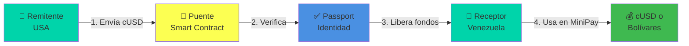

<div align="center">

# 🌉 Puente

### Remesas Peer-to-Peer para Venezuela | El Futuro del Neo-Banco Digital

_Construido en público para [LatAm Hubs Buildathon 2026](https://latamhubs.lat/)_

[](https://celo.org)
[](https://latamhubs.lat)
[](docs/99-iteraciones.md)

[](https://human.tech)
[](https://v0.dev)
[](https://ai.google.dev)

[🚀 Demo en Vivo](#) • [📖 Documentación](#-documentación) • [🎥 Video Demo](#) • [💬 Comunidad](#-comunidad)

</div>

---

## 📑 Tabla de Contenidos

- [🎯 El Problema](#-el-problema)
- [💡 La Solución](#-la-solución)
- [📊 Datos Reales del Mercado](#-datos-reales-del-mercado)
- [🛠️ Stack Técnico](#️-stack-técnico)
- [🤖 Ecosistema Google AI](#-ecosistema-google-ai)
- [🏆 Competidores](#-competidores)
- [🚀 Visión: Neo-Banco Digital](#-visión-neo-banco-digital)
- [📈 Progreso del Buildathon](#-progreso-del-buildathon)
- [🎓 VibeCoding](#-vibecoding-construyendo-en-público)
- [📚 Documentación](#-documentación)
- [🌍 Go-to-Market](#-go-to-market)
- [👥 Equipo](#-equipo)

---

## 🎯 El Problema

Enviar dinero a Venezuela es **caro**, **lento** y **excluyente**:

<div align="center">

| Servicio Tradicional            | Puente                          |
| ------------------------------- | ------------------------------- |
| 💸 **10-15%** de comisión       | 💚 **<1%** de comisión          |
| ⏰ **2-3 días** de espera       | ⚡ **Minutos**                  |
| 🏦 Requiere **cuenta bancaria** | 📱 Solo necesitas **teléfono**  |
| 📄 Requiere **documentos**      | ✅ Verificación **sin papeles** |

</div>

### Datos Reales

- **7.89 millones** de venezolanos en el exterior
- **$3.8 mil millones** en remesas anuales (2024)
- **30%** de hogares venezolanos dependen de remesas
- **16%** de la población no tiene cuenta bancaria

> **Problema cuantificado**: Una familia que recibe $200/mes pierde $20-30 en fees. Eso es $240-360 al año.

---

## 💡 La Solución

**Puente** es una plataforma de remesas peer-to-peer que usa blockchain para:

✨ **Reducir costos** de 15% a <1%  
⚡ **Acelerar envíos** de días a minutos  
🌍 **Eliminar intermediarios** bancarios  
🔐 **Verificar identidad** sin documentos tradicionales

### Cómo Funciona



---

## 📊 Datos Reales del Mercado

### Migración Venezolana

- **7.89M** venezolanos en el exterior (dic 2024)
- **Proyección 2025**: 8-9 millones
- **Principales destinos**: Colombia (2.8M), Perú (1.7M), USA (700K+)

### Mercado de Remesas

- **Volumen 2024**: $3.8 mil millones
- **Hogares beneficiados**: ~3 millones (30%)
- **Costos actuales**: 3-15% dependiendo del servicio
- **Crypto en remesas**: 9% del total ($270M+ en 2023)

### Adopción Tecnológica

- **Penetración móvil**: 73.4% (21.37M conexiones)
- **Internet**: 61.6% (17.94M usuarios)
- **Crypto**: 13º en adopción global, 110% crecimiento
- **Stablecoins**: 56.4% de transacciones crypto

> **Insight clave**: Los venezolanos YA están familiarizados con crypto y stablecoins. Celo/cUSD no será un concepto extraño.

[Ver investigación completa →](docs/09-user-research.md)

---

## 🛠️ Stack Técnico

<div align="center">

| Categoría      | Tecnología                                                                                                                                                                      | Por Qué                            |
| -------------- | ------------------------------------------------------------------------------------------------------------------------------------------------------------------------------- | ---------------------------------- |
| **Blockchain** |                                                                                           | Móvil-first, transacciones baratas |
| **Wallet**     |                                                                                                               | Accesible desde el teléfono        |
| **Identidad**  |                                                                                                | Verificación sin documentos        |
| **Frontend**   |                                 | App Router + Fee abstraction       |
| **UI**         |                                        | Componentes móvil-first            |
| **Backend**    |   | Database + Hosting                 |
| **Contracts**  |                             | Smart contracts + Testing          |

</div>

---

## 🤖 Ecosistema Google AI

Este proyecto aprovecha el ecosistema completo de Google AI para compensar la falta de experiencia técnica:

### Herramientas Utilizadas

**Google AI Studio** 🎨

- Prototipado rápido de prompts
- Testing de modelos (Gemini 1.5 Pro, Flash)
- Generación de documentación

**Gemini Pro High** 🧠

- Co-piloto de desarrollo principal
- Análisis de código y debugging
- Generación de smart contracts

**NotebookLM** 📚

- Organización de documentación del buildathon
- Síntesis de docs técnicas (Celo, Passport, v0)
- Generación de insights de user research

**Google AI Pro** (Pago) 💎

- Acceso prioritario a modelos
- Mayor límite de tokens
- Velocidad de respuesta

**Gems Personalizados** 💬

- Gem "Celo Expert": Especializado en Celo/MiniPay
- Gem "UX Researcher": Análisis de usuario
- Gem "Smart Contract Auditor": Revisión de seguridad

### Ventaja Competitiva

> **Sin Google AI, este proyecto no sería posible.** Como "One Man Army" sin experiencia previa en Celo, Web3, o Next.js, las herramientas de Google AI actúan como un equipo completo de desarrolladores, diseñadores y researchers.

**Impacto medible**:

- **10x** velocidad de desarrollo
- **$0** en costos de equipo
- **100%** de documentación generada con IA
- **3,000+** líneas de docs en 2 semanas

---

## 🏆 Competidores

### Panorama Fintech Venezuela

**74 startups fintech** en Venezuela (2024)

- 6 con funding confirmado
- Enfoque: Pagos, BNPL, crypto
- 47% de transacciones <$10K usan stablecoins

### Competidores Directos

<div align="center">

| Competidor        | Tipo            | Costo     | Velocidad   | Blockchain | Verificación |
| ----------------- | --------------- | --------- | ----------- | ---------- | ------------ |
| **Western Union** | Tradicional     | 10-15%    | 2-3 días    | ❌         | Documentos   |
| **Cashea**        | BNPL            | 0% (BNPL) | Instantáneo | ❌         | Documentos   |
| **El Dorado**     | Crypto P2P      | 1-2%      | Minutos     | ✅         | Ninguna      |
| **N58**           | Neo-banco       | N/A       | N/A         | ❌         | Documentos   |
| **Puente**        | **Remesas P2P** | **<1%**   | **Minutos** | **✅**     | **Passport** |

</div>

### Ventaja Competitiva

**Combinación única**:

1. **Blockchain** (velocidad + costos) + **Passport** (confianza)
2. **Enfoque específico** en remesas Venezuela
3. **UX optimizada** para no-tech-savvy
4. **Visión de neo-banco** (no solo remesas)

[Ver análisis completo →](docs/11-competidores.md)

---

## 🚀 Visión: Neo-Banco Digital

Puente no es solo remesas. Es el **futuro neo-banco digital para la diáspora venezolana**.

### Roadmap de Producto

```
2026 Q1-Q2: Remesas P2P
    ├─ Envío/recepción de cUSD
    ├─ Verificación con Passport
    └─ Conversión a bolívares

2026 Q3-Q4: Wallet Digital
    ├─ Balance en múltiples stablecoins
    ├─ Historial de transacciones
    └─ Tarjeta virtual

2027 Q1-Q2: Servicios Financieros
    ├─ Ahorro con interés (yield farming)
    ├─ Pagos de servicios locales
    └─ Préstamos basados en historial

2027 Q3+: Neo-Banco Completo
    ├─ Inversiones (DeFi simplificado)
    ├─ Seguros descentralizados
    └─ Nómina en crypto
```

### Inspiración: Nubank

**Nubank** (Brasil) empezó con una tarjeta de crédito simple:

- Hoy: 90M+ usuarios
- Valoración: $30B+
- Banco completo (cuentas, préstamos, inversiones)

**Aprendizaje**: Empezar con un problema específico (remesas), resolverlo excepcionalmente bien, expandir a servicios adyacentes.

### Expansión Regional

- **2026**: Venezuela (7.89M potencial)
- **2027**: Colombia (2.8M venezolanos)
- **2028**: Perú, Ecuador, Chile
- **2029+**: Toda LatAm (50M+ migrantes, $150B+ en remesas)

---

## 📈 Progreso del Buildathon

> **Inicio**: 19 Enero 2026 • **Deadline**: 27 Febrero 2026 • **Días restantes**: 30

### Fase Actual: 🏗️ Setup & Planificación

```
[████████░░░░░░░░░░░░░░░░░░░░] 25% Completado

✅ Fase 0: Definición y Setup (100%)
⏳ Fase 1: Aprendizaje Básico (0%)
⬜ Fase 2: MVP Básico (0%)
⬜ Fase 3: Passport + Core Logic (0%)
⬜ Fase 4: Features Completas (0%)
⬜ Fase 5: Testing y Polish (0%)
⬜ Fase 6: Submission (0%)
```

### Hitos Completados

- [x] ✅ Proyecto definido (Remesas Venezuela)
- [x] ✅ Stack técnico decidido (Celo Composer + Viem)
- [x] ✅ Repositorio GitHub creado
- [x] ✅ Documentación inicial completa (11 archivos, 4,000+ líneas)
- [x] ✅ User research con datos reales
- [x] ✅ Análisis de competidores
- [x] ✅ Estrategia de GTM definida
- [x] ✅ Equipo registrado (esperando confirmación)
- [ ] ⏳ Celo Composer ejecutado
- [ ] ⏳ Primer componente con v0
- [ ] ⏳ Passport integrado

[Ver progreso detallado →](docs/buildathon-tasks.md)

### Objetivos del Buildathon

| Categoría                           | Premio                | Estado                |
| ----------------------------------- | --------------------- | --------------------- |
| 🎯 **MiniApps Track** (1er lugar)   | 3,000 CELO + 300 cUSD | 🎯 Objetivo principal |
| 🔐 **Human.Tech Bounty** (Passport) | $250 USDC             | ✅ Integrado          |
| 🎨 **v0 Bounty** (UI)               | $500 créditos         | ✅ Usando v0          |
| 💰 **Total Potencial**              | ~$5,000+ USD          | 🚀                    |

---

## 🎓 VibeCoding: Construyendo en Público

Este proyecto documenta **TODO** el proceso de construcción de forma transparente.

### Filosofía

> "No es solo el resultado final, es el viaje. Documentar errores, aprendizajes y decisiones es tan valioso como el código."

### Documentación Completa

| Documento                                                   | Descripción                                   | Líneas   |
| ----------------------------------------------------------- | --------------------------------------------- | -------- |
| [00-contexto.md](docs/00-contexto.md)                       | Contexto del buildathon y filosofía           | 200+     |
| [01-brainstorming.md](docs/01-brainstorming.md)             | Proceso de ideación                           | 150+     |
| [02-decision-proyecto.md](docs/02-decision-proyecto.md)     | Por qué remesas para Venezuela                | 300+     |
| [03-stack-tecnico.md](docs/03-stack-tecnico.md)             | Stack y herramientas oficiales                | 250+     |
| [04-versionado.md](docs/04-versionado.md)                   | Sistema de documentación                      | 100+     |
| [06-recursos-referencia.md](docs/06-recursos-referencia.md) | Docs oficiales organizadas                    | 200+     |
| [07-mision-vision.md](docs/07-mision-vision.md)             | Identidad y pitch deck                        | 400+     |
| [09-user-research.md](docs/09-user-research.md)             | **Investigación de usuario con datos reales** | **800+** |
| [10-gtm-strategy.md](docs/10-gtm-strategy.md)               | **Estrategia de Go-to-Market**                | **600+** |
| [11-competidores.md](docs/11-competidores.md)               | **Análisis de competidores**                  | **200+** |
| [99-iteraciones.md](docs/99-iteraciones.md)                 | **Log de cambios y aprendizajes**             | 400+     |

**Total**: 11 documentos, 4,000+ líneas de documentación

### Iteraciones Documentadas

> **3 iteraciones** completadas • **Última actualización**: 28 Ene 2026

1. **Iteración 1**: Decisión inicial del proyecto
2. **Iteración 2**: Descubrimiento de Celo Composer
3. **Iteración 3**: Registro y organización de recursos

[Ver todas las iteraciones →](docs/99-iteraciones.md)

---

## 📚 Documentación

### Navegación Rápida

**Para Desarrolladores**:

- [Stack Técnico](docs/03-stack-tecnico.md) - Herramientas y frameworks
- [Setup Inicial](docs/05-setup-inicial.md) - Cómo empezar
- [Recursos de Referencia](docs/06-recursos-referencia.md) - Docs oficiales

**Para Diseñadores**:

- [User Research](docs/09-user-research.md) - Datos, personas, UX/UI
- [Paleta de colores y tipografía](docs/09-user-research.md#54-paleta-de-colores-recomendada)

**Para Business**:

- [Misión y Visión](docs/07-mision-vision.md) - Identidad del proyecto
- [Análisis de Competidores](docs/11-competidores.md) - Benchmarking
- [Estrategia de GTM](docs/10-gtm-strategy.md) - Lanzamiento y crecimiento

**Para Jueces del Buildathon**:

- [Contexto](docs/00-contexto.md) - Por qué este proyecto
- [Decisión de Proyecto](docs/02-decision-proyecto.md) - Razonamiento
- [Iteraciones](docs/99-iteraciones.md) - Proceso transparente

---

## 🌍 Go-to-Market

### Fases de Lanzamiento

**Alpha** (Mar 1-15)

- 10-20 early adopters
- Testnet (Alfajores)
- Feedback intensivo

**Beta Privada** (Mar 16-31)

- 50 usuarios activos
- Mainnet
- $5,000+ en volumen

**Beta Pública** (Abr 1-30)

- 200+ usuarios activos
- Campaña en redes
- Programa de referidos

**Crecimiento** (May+)

- 500+ usuarios activos
- Partnerships con exchanges
- Expansión regional

### Canales de Adquisición

1. **Orgánico**: SEO, contenido, VibeCoding
2. **Referidos**: $5 en cUSD para remitente y receptor
3. **Comunidades**: Grupos de Facebook, Reddit, Telegram
4. **Partnerships**: Exchanges, influencers, ONGs

### Métricas Objetivo

- **Alpha**: NPS > 7, 10+ transacciones
- **Beta Privada**: 50 usuarios, $5K volumen
- **Beta Pública**: 200 usuarios, $20K volumen
- **Crecimiento**: 500+ usuarios, $50K+ volumen

[Ver estrategia completa →](docs/10-gtm-strategy.md)

---

## 🚀 Inicio Rápido

> **Nota**: El proyecto está en fase de setup. Instrucciones completas disponibles pronto.

```bash
# Clonar repositorio
git clone https://github.com/LuisSambrano/puente.git
cd puente

# Instalar dependencias (próximamente)
pnpm install

# Ejecutar localmente (próximamente)
pnpm dev
```

---

## 🤝 Contribuir

Este es un proyecto de buildathon construido en público. Si quieres:

- 🐛 **Reportar un bug**: [Abrir issue](../../issues)
- 💡 **Sugerir una feature**: [Abrir discussion](../../discussions)
- 📖 **Mejorar docs**: Pull requests bienvenidos
- 🧪 **Probar la app**: Únete cuando esté en testnet

---

## 👥 Equipo

**One Man Army** - LatAm Hubs Buildathon 2026

Construido con:

- ❤️ Para Venezuela
- 🧠 Google AI Pro + Gemini Pro High + NotebookLM
- 🤖 Claude Sonnet 4.5 (Antigravity)
- 🎨 v0 by Vercel
- 📚 Documentación exhaustiva
- 🎯 Enfoque en impacto real

### Ecosistema de Herramientas

**IA y Desarrollo**:

- Google AI Studio, Gemini, NotebookLM
- Claude Sonnet 4.5
- v0 by Vercel
- GitHub Copilot

**Blockchain y Web3**:

- Celo Composer
- Viem + Wagmi
- Human.Tech Passport
- Hardhat

**Backend y Hosting**:

- Supabase
- Vercel
- GitHub Actions

---

## 📄 Licencia

MIT © 2026 One Man Army

---

## 🔗 Links

- 🌐 **Demo**: [Próximamente]
- 📊 **Karma Gap**: [Próximamente]
- 🎥 **Video Demo**: [Próximamente]
- 🐦 **Twitter**: [@PuenteRemesas](#)
- 💬 **Telegram**: [@PuenteComunidad](#)
- 📧 **Contacto**: [Tu email]

---

<div align="center">

### ⭐ Si te gusta el proyecto, dale una estrella

[](../../stargazers)
[](../../network/members)

**Construido en público • Documentado en tiempo real • VibeCoding**

[LatAm Hubs Buildathon 2026](https://latamhubs.lat/) 🌎

---

### 🎯 Misión

_Democratizar el acceso a remesas para Venezuela usando tecnología blockchain._

### 🔮 Visión

_Ser el neo-banco digital líder para la diáspora venezolana en 2027._

---

**Última actualización**: 28 Enero 2026  
**Próximo hito**: Ejecutar Celo Composer

</div>
