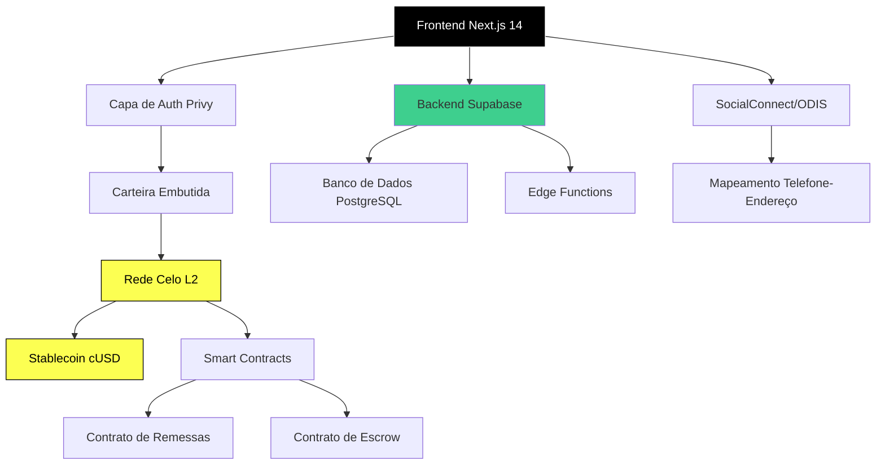

[English](./README.md) | [Español](./README.es.md) | [Português](./README.pt.md)

# Puente

Plataforma de remessas P2P para América Latina construída na blockchain Celo.

<!-- CTAs -->
<p align="center">
  <a href="https://github.com/LuisSambrano/puente-fintech-dapp/stargazers"></a>
  <a href="https://github.com/LuisSambrano/puente-fintech-dapp/network/members"></a>
  <a href="https://github.com/LuisSambrano/puente-fintech-dapp/issues"></a>
  <a href="https://github.com/LuisSambrano/puente-fintech-dapp/blob/main/LICENSE"></a>
</p>

> [!IMPORTANT] > **Licencia**: Este proyecto está licenciado bajo [Business Source License 1.1](LICENSE).
> Puedes ver y estudiar el código fuente con fines educativos, pero **el uso comercial requiere una licencia separada**.
> Ver [LICENSE](LICENSE) para términos completos.

## Arquitetura



## Características

### Integração Blockchain

- **Liquidação Celo L2**: Finalidade rápida (<5s)
- **Stablecoin cUSD**: Proteção contra volatilidade da moeda local
- **Smart Contracts**: Contratos verificados na Celo Sepolia para roteamento seguro de fundos
- **Abstração de Gas**: Taxas de transação abaixo de $0.01

### Identidade e Descoberta

- **SocialConnect**: Mapeamento telefone-endereço via ODIS
- **Descoberta Social**: Envie fundos usando números de telefone em vez de endereços de carteira
- **Preservação de Privacidade**: Lookup de identidade descentralizado sem expor dados do usuário

### Experiência do Usuário

- **Glassmorphism UI**: Interface translúcida moderna com profundidade e hierarquia
- **Temas Dinâmicos**: Suporte a modo claro/escuro (temas Solaris/Obsidian)
- **Controles de Privacidade**: Saldos sensíveis obscurecidos por padrão até autenticação
- **Mobile-First**: PWA otimizada para MiniPay (Opera Mini) e redes de baixa largura de banda

### Segurança

- **Não-Custodial**: Usuários mantêm controle total de seus fundos
- **Autenticação Privy**: Carteiras embutidas com suporte a passkey
- **Log de Auditoria**: Histórico de transações em tempo real via Supabase
- **Verificação de Smart Contract**: Todos contratos verificados no explorador de blocos Celo

## Stack Tecnológico


**Frontend**:

- [Next.js 14](https://nextjs.org/) - Framework React com App Router
- [TypeScript](https://www.typescriptlang.org/) - Desenvolvimento type-safe
- [Tailwind CSS](https://tailwindcss.com/) - Estilos utility-first
- [Framer Motion](https://www.framer.com/motion/) - Animações aceleradas por hardware

**Blockchain**:

- [Celo](https://celo.org/) - Rede blockchain L2 (Sepolia testnet)
- [cUSD](https://docs.celo.org/protocol/stability) - Stablecoin Celo Dollar
- [SocialConnect](https://docs.celo.org/protocol/identity) - Protocolo de identidade descentralizada
- [ODIS](https://docs.celo.org/protocol/identity/odis) - Serviço de identidade descentralizada oblivious

**Infraestrutura**:

- [Privy](https://privy.io/) - Autenticação de carteira embedded
- [Supabase](https://supabase.com/) - Banco de dados PostgreSQL e Edge Functions
- [Vercel](https://vercel.com/) - Deploy em rede edge

## Primeiros Passos

### Pré-requisitos

- Node.js 18 ou superior
- Gerenciador de pacotes pnpm
- Conta Privy (tier gratuito disponível)
- Conta Supabase (tier gratuito disponível)
- Carteira Celo com cUSD testnet (para testes)

### Instalação

1. **Clonar o repositório**:

```bash
git clone https://github.com/LuisSambrano/puente.git
cd puente
```

2. **Instalar dependências**:

```bash
pnpm install
```

3. **Configurar variáveis de ambiente**:

Criar um arquivo `.env.local` no diretório raiz:

```env
NEXT_PUBLIC_PRIVY_APP_ID=seu_privy_app_id
NEXT_PUBLIC_SUPABASE_URL=sua_url_supabase
NEXT_PUBLIC_SUPABASE_ANON_KEY=sua_chave_anon_supabase
NEXT_PUBLIC_CELO_NETWORK=celo-sepolia
```

4. **Executar servidor de desenvolvimento**:

```bash
pnpm dev
```

## Contribuir

Contribuições são bem-vindas. Por favor siga estas diretrizes:

1. Faça fork do repositório
2. Crie uma branch de feature: `git checkout -b feature/descricao`
3. Faça suas alterações com commits claros e atômicos
4. Execute testes: `pnpm test`
5. Push para seu fork: `git push origin feature/descricao`
6. Envie um pull request com descrição detalhada

## Estrutura do Projeto

```
puente/
├── apps/
│   ├── web/                    # Aplicação frontend Next.js
│   │   ├── src/
│   │   │   ├── app/           # Páginas App Router
│   │   │   ├── components/    # Componentes React
│   │   │   ├── lib/           # Utilidades e configurações
│   │   │   └── types/         # Definições TypeScript
│   │   └── public/            # Assets estáticos
│   └── contracts/             # Desenvolvimento de smart contracts
│       ├── contracts/         # Contratos Solidity
│       ├── scripts/           # Scripts de deploy
│       └── test/              # Testes de contratos
├── docs/                      # Documentação
├── brandkit/                  # Assets de marca
└── turbo.json                 # Configuração Turborepo
```

## 🔬 Pesquisa e Registro de Decisões

Este projeto segue uma metodologia **Research-First**. Todas as decisões estratégicas estão documentadas:

| Documento                                     | Propósito                                      |
| --------------------------------------------- | ---------------------------------------------- |
| [KEY_FINDINGS.md](./research/KEY_FINDINGS.md) | Insights destilados da pesquisa                |
| [prompts/](./research/prompts/)               | Módulos de investigação com tracking           |
| [docs/](./docs)                               | Documentos originais de pesquisa (26 arquivos) |

> **Resumo Executivo**: Veja [KEY_FINDINGS.md](./research/KEY_FINDINGS.md) para insights destilados e decisões arquitetônicas.

## Licença

Licença MIT - Veja [LICENSE](LICENSE) para detalhes.

## Links

- **Repositório**: [github.com/LuisSambrano/puente](https://github.com/LuisSambrano/puente)
- **Autor**: [Luis Sambrano](https://github.com/LuisSambrano)
- **Documentação**: [docs/](./docs)
- **Pesquisa**: [research/](./research)
- **Documentação Celo**: [docs.celo.org](https://docs.celo.org)

---

[English](./README.md) | [Español](./README.es.md) | **Português**
