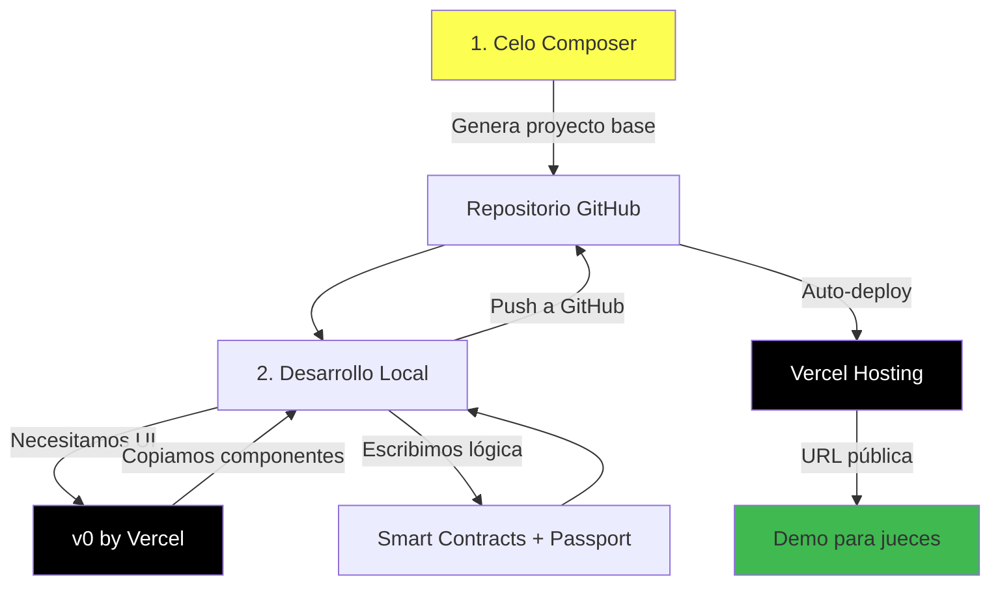

# Estrategia de Herramientas: División de Responsabilidades

> **Fecha**: 28 Enero 2026  
> **Objetivo**: Clarificar qué herramienta hace qué para evitar solapamiento

---

## 🎯 Resumen Ejecutivo

**Pregunta clave**: ¿Cómo evitamos solapamiento entre Celo Composer, v0, y Vercel?

**Respuesta**: Cada herramienta tiene un rol específico y complementario.

---

## 🔧 División de Responsabilidades

### 1. **Celo Composer** → Estructura Base (80% del proyecto)

**Qué hace**:

- ✅ Genera estructura completa del proyecto Next.js
- ✅ Configura Hardhat para smart contracts
- ✅ Integra MiniPay wallet
- ✅ Setup de TailwindCSS
- ✅ Configuración de Celo SDK
- ✅ Ejemplos de contratos y componentes

**Por qué lo usamos**:

- Es el **template oficial** del buildathon
- Tiene toda la integración de Celo pre-configurada
- Los jueces **esperan ver** esta estructura
- **Crítico**: Sin esto, no cumplimos requisitos del track MiniApps

**Cuándo se usa**: **Una sola vez** al inicio del proyecto

**Código que genera**: ~80% del proyecto base

---

### 2. **v0 by Vercel** → Componentes UI (Diseño)

**Qué hace**:

- ✅ Genera componentes React individuales
- ✅ Diseño visual profesional (UI/UX)
- ✅ Animaciones y micro-interacciones
- ✅ Responsive design mobile-first
- ✅ TailwindCSS styling

**Por qué lo usamos**:

- Acelera creación de UI (10x más rápido)
- Diseños profesionales instantáneos
- Cumple con **bounty de v0** ($500 créditos)
- Evita perder tiempo en CSS

**Cuándo se usa**: Cada vez que necesitamos un **componente visual nuevo**

**Código que genera**: Componentes específicos que **copiamos** al proyecto de Celo Composer

**Ejemplos de uso**:

- Landing page hero
- Formulario de envío de remesa
- Card de transacción
- Modal de confirmación
- Dashboard de usuario

---

### 3. **Vercel** → Deployment y Hosting (Infraestructura)

**Qué hace**:

- ✅ Deploy automático desde GitHub
- ✅ Preview deployments para cada PR
- ✅ Environment variables management
- ✅ Analytics y Speed Insights
- ✅ Edge functions (si necesitamos)
- ✅ Integraciones (Supabase, etc.)

**Por qué lo usamos**:

- Hosting gratuito y ultra-rápido
- Integración nativa con Next.js
- URL pública para demo
- CI/CD automático

**Cuándo se usa**: **Continuamente** (auto-deploy en cada push)

**Código que genera**: **Ninguno**, solo hostea y provee infraestructura

---

## 🔄 Flujo de Trabajo Completo



---

## 📝 Paso a Paso Concreto

### **Paso 1: Celo Composer (Base del Proyecto)** ⏳

**Comando**:

```bash
cd /Users/luissambrano/Proyectos/Lab/puente
npx @celo/celo-composer@latest create
```

**Opciones a seleccionar**:

1. Project name: `.` (directorio actual)
2. Template: **MiniPay**
3. Framework: **Next.js**
4. Smart contracts: **Hardhat**
5. Styling: **TailwindCSS**

**Resultado esperado**:

```
puente/
├── packages/
│   ├── react-app/          # Frontend Next.js
│   │   ├── components/
│   │   ├── pages/
│   │   ├── hooks/
│   │   └── utils/
│   └── hardhat/            # Smart contracts
│       ├── contracts/
│       ├── scripts/
│       └── test/
├── package.json
├── pnpm-workspace.yaml
└── README.md
```

**Commit**: `feat: initialize project with Celo Composer`

---

### **Paso 2: v0 para Componentes Específicos**

**Ejemplo**: Necesitamos el componente de "Enviar Remesa"

**En v0.dev**:

```
Prompt: "Create a mobile-first remittance form component with:
- Amount input in USD
- Recipient phone number input with Venezuela flag
- Estimated arrival time display
- Fee breakdown (transparent)
- CTA button 'Send Money'
- Use Celo brand colors (#FCFF52, #00D4AA)
- TailwindCSS
- React + TypeScript"
```

**v0 genera**: Componente React completo

**Nosotros**:

1. Copiamos el código generado
2. Lo pegamos en `/packages/react-app/components/SendRemittance.tsx`
3. Ajustamos imports
4. Conectamos con lógica de smart contracts

**Commit**: `feat: add SendRemittance component (generated with v0)`

---

### **Paso 3: Desarrollo de Lógica de Negocio**

**Nosotros escribimos** (o con ayuda de Antigravity):

**Smart Contracts** (`/packages/hardhat/contracts/`):

```solidity
// RemittanceEscrow.sol
contract RemittanceEscrow {
    function sendRemittance(address recipient, uint256 amount) external;
    function releaseRemittance(bytes32 remittanceId) external;
}
```

**Integración Passport** (`/packages/react-app/hooks/`):

```typescript
// usePassport.ts
export function usePassport() {
  const verifyIdentity = async () => {
    // Lógica de verificación con Human.Tech
  };
  return { verifyIdentity };
}
```

**Conexión Supabase** (`/packages/react-app/lib/`):

```typescript
// supabase.ts
export const supabase = createClient(
  process.env.NEXT_PUBLIC_SUPABASE_URL,
  process.env.NEXT_PUBLIC_SUPABASE_ANON_KEY,
);
```

**v0 NO hace esto**, solo UI

---

### **Paso 4: Push a GitHub**

```bash
git add .
git commit -m "feat: complete remittance flow with Passport integration"
git push origin main
```

---

### **Paso 5: Vercel Auto-Deploy**

**Vercel detecta el push** y automáticamente:

1. Instala dependencias (`pnpm install`)
2. Ejecuta build (`pnpm build`)
3. Deploya a URL pública
4. Comenta en el commit con preview URL

**Resultado**: `https://puente-remesas.vercel.app`

---

## 🎨 Ejemplo Concreto: Landing Page Hero

### **v0 genera** (diseño puro):

```tsx
// Hero.tsx (generado por v0)
export function Hero() {
  return (
    <div className="bg-gradient-to-r from-[#FCFF52] to-[#00D4AA] min-h-screen flex items-center justify-center">
      <div className="text-center px-4">
        <h1 className="text-5xl md:text-7xl font-bold text-black mb-4">
          Envía dinero a Venezuela
        </h1>
        <p className="text-xl md:text-2xl text-gray-800 mb-8">
          Sin comisiones, en minutos, sin documentos
        </p>
        <button className="bg-black text-white px-8 py-4 rounded-full text-lg font-semibold hover:bg-gray-800 transition-colors">
          Empezar Ahora
        </button>
      </div>
    </div>
  );
}
```

### **Nosotros agregamos** (lógica de negocio):

```tsx
// Hero.tsx (con lógica integrada)
import { useConnect } from "wagmi";
import { useMiniPay } from "@/hooks/useMiniPay";
import { useRouter } from "next/router";

export function Hero() {
  const { connect } = useConnect();
  const { isConnected } = useMiniPay();
  const router = useRouter();

  const handleCTA = () => {
    if (isConnected) {
      router.push("/send");
    } else {
      connect();
    }
  };

  return (
    <div className="bg-gradient-to-r from-[#FCFF52] to-[#00D4AA] min-h-screen flex items-center justify-center">
      <div className="text-center px-4">
        <h1 className="text-5xl md:text-7xl font-bold text-black mb-4">
          Envía dinero a Venezuela
        </h1>
        <p className="text-xl md:text-2xl text-gray-800 mb-8">
          Sin comisiones, en minutos, sin documentos
        </p>
        <button
          onClick={handleCTA}
          className="bg-black text-white px-8 py-4 rounded-full text-lg font-semibold hover:bg-gray-800 transition-colors"
        >
          {isConnected ? "Enviar Remesa" : "Conectar Wallet"}
        </button>
      </div>
    </div>
  );
}
```

**Diferencia**:

- v0: Diseño visual perfecto
- Nosotros: Lógica de wallet, routing, estado

---

## 📋 Checklist de Decisión

**Para cada feature, pregúntate**:

- [ ] ¿Necesito estructura base? → **Celo Composer** (una sola vez al inicio)
- [ ] ¿Necesito un componente visual? → **v0** (genera y copiamos)
- [ ] ¿Necesito lógica de blockchain? → **Nosotros** (Hardhat + wagmi)
- [ ] ¿Necesito backend/database? → **Supabase** (integrado con Vercel)
- [ ] ¿Necesito deployment? → **Vercel** (auto-deploy desde GitHub)
- [ ] ¿Necesito verificación de identidad? → **Human.Tech Passport** (SDK)

---

## 🏆 Para el Buildathon

### **Los jueces esperan ver**:

✅ **Celo Composer como base** (requisito del track MiniApps)  
✅ **Smart contracts funcionales** (nosotros escribimos)  
✅ **Integración MiniPay** (viene con Celo Composer)  
✅ **UI profesional** (v0 + nosotros)  
✅ **Passport integrado** (nosotros, bounty de Human.Tech)  
✅ **Deploy público** (Vercel hosting)  
✅ **Código en GitHub** (público, VibeCoding)

### **NO esperan**:

❌ Código 100% escrito a mano desde cero  
❌ Diseño CSS sin herramientas  
❌ Infraestructura compleja self-hosted  
❌ Reinventar la rueda

---

## 🎯 Resumen de Roles

| Herramienta       | Rol               | Cuándo                | Código Generado               |
| ----------------- | ----------------- | --------------------- | ----------------------------- |
| **Celo Composer** | Estructura base   | Una vez (inicio)      | 80% del proyecto              |
| **v0**            | Componentes UI    | Cada componente nuevo | Componentes individuales      |
| **Nosotros**      | Lógica de negocio | Continuamente         | Smart contracts, hooks, utils |
| **Vercel**        | Hosting           | Cada push             | Ninguno (solo hostea)         |
| **Supabase**      | Backend           | Configuración inicial | Schema, Edge Functions        |
| **Passport**      | Verificación      | Integración           | SDK (usamos, no generamos)    |

---

## 🚀 Próximo Paso Inmediato

**Ejecutar Celo Composer**:

```bash
cd /Users/luissambrano/Proyectos/Lab/puente
npx @celo/celo-composer@latest create
```

**Tiempo estimado**: 5-10 minutos

**Resultado**: Proyecto completo listo para desarrollo

---

## 📚 Referencias

- [Celo Composer Docs](https://github.com/celo-org/celo-composer)
- [v0 by Vercel](https://v0.dev)
- [Vercel Deployment](https://vercel.com/docs)
- [MiniPay Integration](https://docs.celo.org/minipay)
